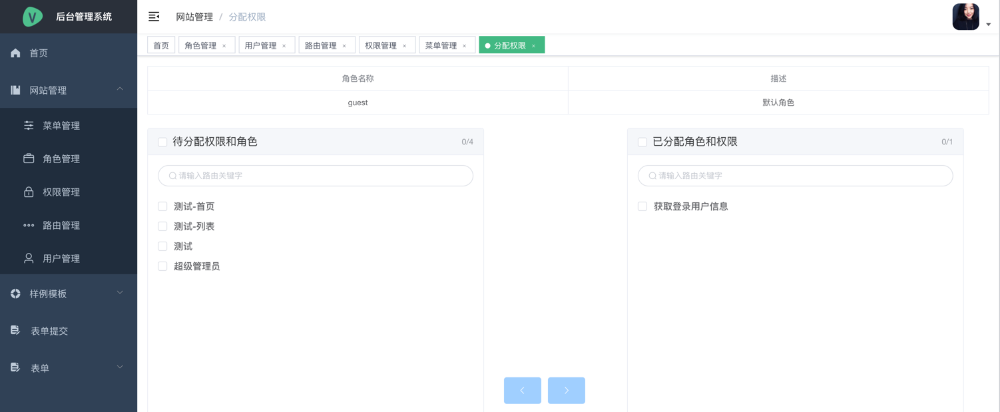

# fly

#### 介绍
后台管理系统模板, Yii2做后端 vue2做前端,其中实现了 RBAC模块 以及前端的一些基础封装

#### 开发环境

1. php 7.4 
2. mysql 8.0
3. composer 2.0.12
4. nginx
5. linux
6. node v16.17.0
7. npm 8.15.0

#### 安装说明

```
$ git clone ....fly.git fly
$ cd /path/to/fly/backend 
# 配置mysql redis 等
$ composer install
# 执行migrate
$ php yii migrate/up

# 前端页面
$ cd /path/to/fly/frontend
$ npm install


# 启动前端页面
$ npm run dev 
```

#### 功能展示
1. 首页页面
2. 用户管理 
3. 路由管理
4. 权限管理
5. 角色管理
6. 菜单管理
7. 分配页面

#### 代码展示
1. 使前端封装的api请求
```
import request from '@/utils/request'
/**
 * 创建用户
 * @returns {AxiosPromise}
 */
export function addUser(data) {
  return request({
    url: '/auth/user/add',
    method: 'post',
    data
  })
}

```
2. 添加前端路由
```
# router/index.js
import auth from '@/router/auth'
import err from '@/router/error'
import example from '@/router/example'
import appRouter from '@/router/app'

export const constantRoutes = [
  ...appRouter,
  ...auth,
  ...example,

  // 404 page must be placed at the end !!!
  ...err
]
```
3. 使用前端统一列表搜索栏 例如: 菜单管理 
- 3.1 组建模板
```
<search-box
  :filters="filters"
  :model="searchModel"
  :row-span="6"
  label-width="80px"
  @search="search"
  @reset="reset"
>
<!--   组建插槽 可以添加自定义按钮在searchbox中 -->
 <el-button
    slot="buttonGroup"
    type="primary"
    size="small"
    plain
    @click="addUser('添加用户')"
    icon="el-icon-plus">添加用户
  </el-button>
</search-box>
```
- 3.2 引入SearchBox组建
```
export default {
    name: 'User',
    components: { SearchBox },
    ...
}
```
- 3.3 配置搜索搜索条件 目前只支持 input 和 select 可根据自己需求情况自行添加
```
data() {
    # fileters 就是过滤条件
    filters: [
        {
          type: 'input', # 类型输入框
          name: 'username', # 条件名称 必须要跟 searchModel 字段名称对应
          placeholder: '', # 占位字符
          labelText: '用户名称:', # text显示
          options: [] # 仅仅对select 有效
        },
        {
          type: 'input',
          name: 'phone',
          placeholder: '',
          labelText: '手机号:',
          options: []
        },
        {
          type: 'select',
          name: 'status',
          placeholder: '',
          labelText: '状态:',
          options: [
            {label: '正常', value: 10},
            {label: '无效', value: 9}
          ]
        }
    ],
    searchModel: {
        page: 1,
        limit: 20,
        username: '',
        phone: '',
        statue: ''
      },
}
```
- 3.4 配置清空搜索条件方法和清空搜索条件方法
```
methods: {
    search() {
      console.log(this.searchModel)
    },
    reset() {
      console.log(this.searchModel)
    }
}
```
